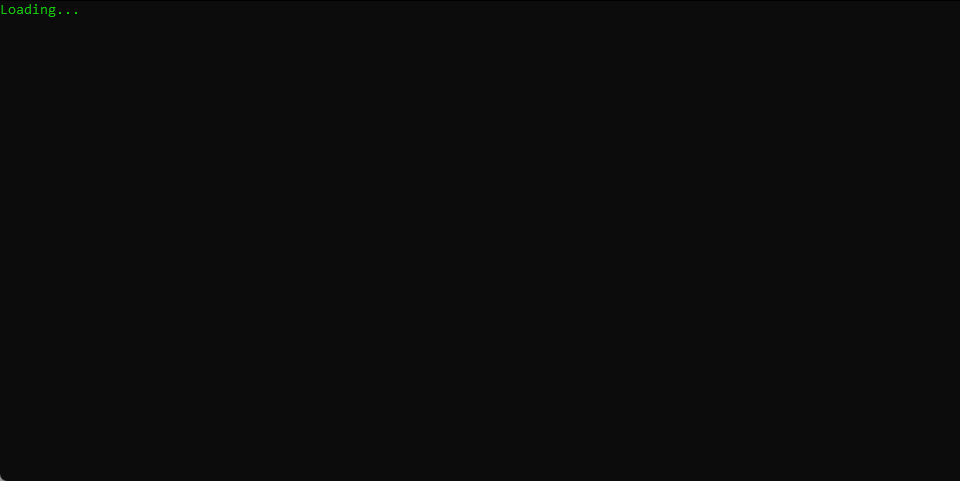
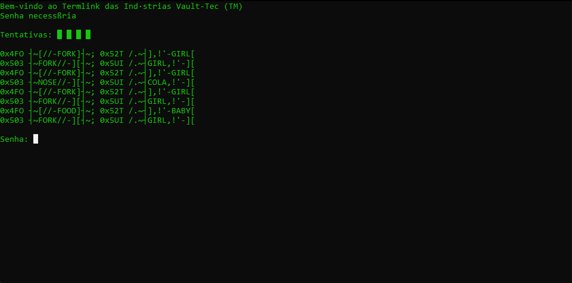
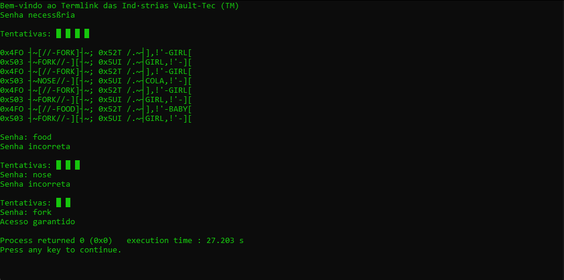

# Termlink
Uma imitação do terminal que há em Fallout 4 

  <h2>Inspiração </h2>
  
Para aqueles que já tiveram a experiência de jogar Fallout 3, Fallout: New Vegas ou Fallout, 4 em algum momento do jogo se depararam com um pequeno mini-game de <i>haking</i> em algum terminal para liberar o acesso de uma sala dentro de certos edifícios no mapa, certo?  Observando como funcionava esse pequeno desafio no jogo tive curisidade de tentar implementa-lo em código de linguagem C e este repósitorio mostra minha pequena tentativa de como foi construir tal programa. 

  
O código inicial pode não ser o dos melhores no momento mas sempre estarei trazendo melhorias e atualizações. Sujestões são bem vindas. 

  <h2>Funcionamento </h2>
  <ul>
    <li>
      <h3>1 - Tela de Loading: </h3>
      
    </li>
    <li>
      <h3>2 - Tela inicial: </h3>
      
    </li>
    <li>
      <h3>3 - Funcionamento das tentativas: </h3>
      
    </li>
  </ul>

<h2>Atualizações </h2>

Aqui ficaram gravadas as melhorias no código.

